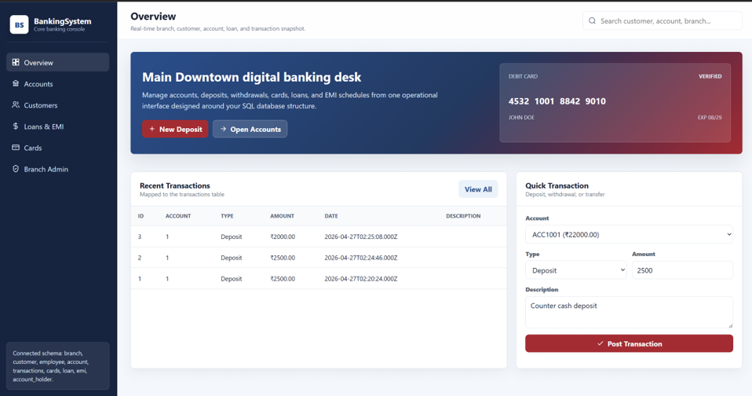
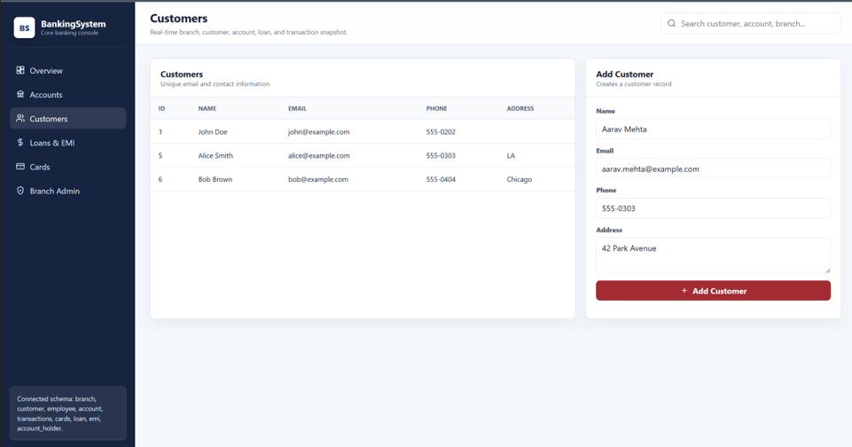
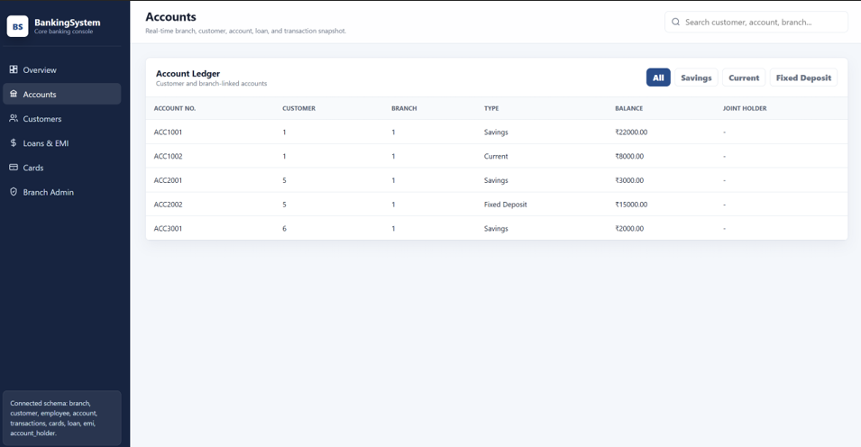
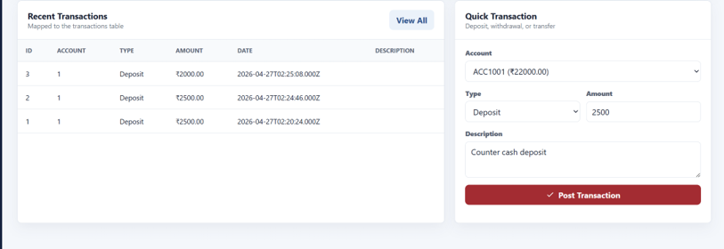
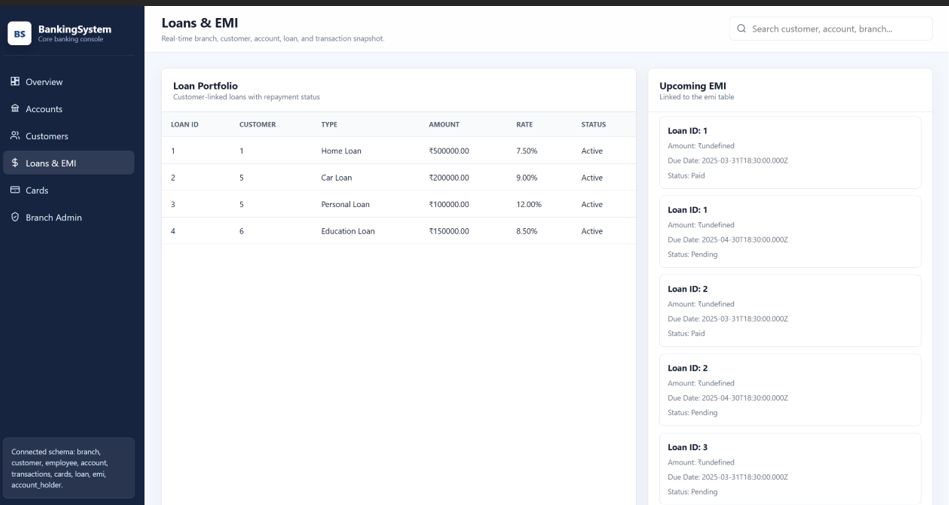
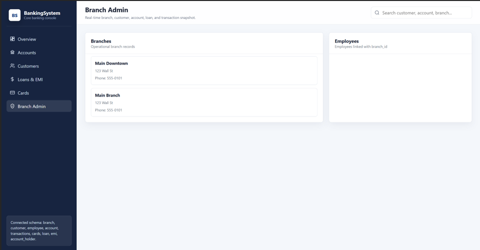
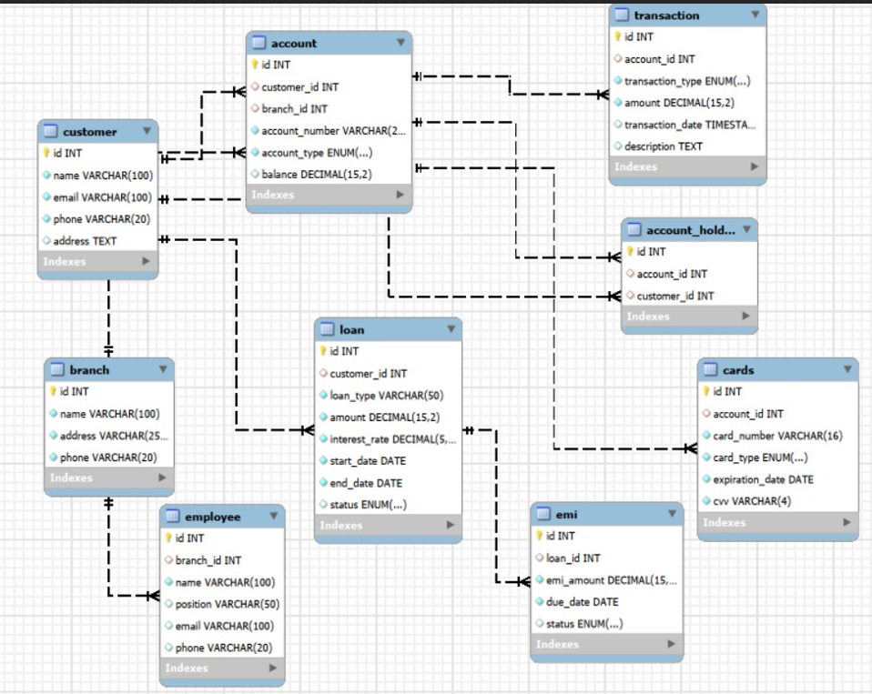
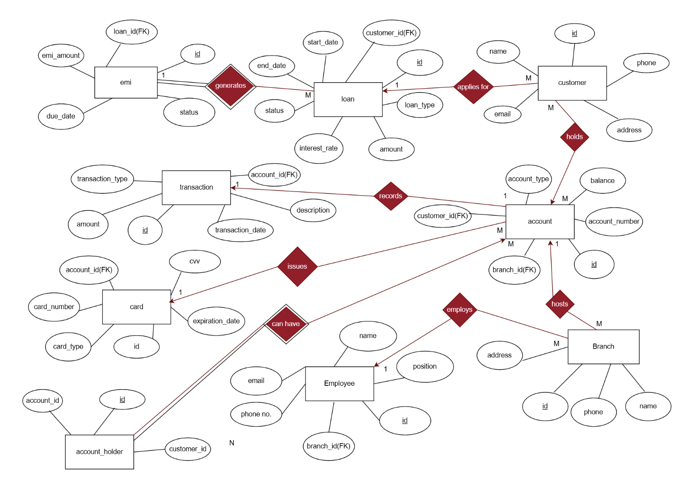

# 🏦 Banking Management System

A full-stack Banking Management System developed as a Database Management Systems (DBMS) mini project. The application provides a simple web interface for managing customers, bank accounts, transactions, loans, EMIs, employees, branches, and cards while demonstrating core DBMS concepts such as normalization, SQL queries, triggers, views, cursors, and transaction management.

---

## 📌 Features

- 👤 Customer Management
- 🏦 Bank Account Management
- 💳 Debit & Credit Card Management
- 💰 Deposit & Withdrawal Transactions
- 📊 Transaction History
- 💵 Loan Management
- 📅 EMI Tracking
- 👨‍💼 Employee Management
- 🌍 Branch Management
- 🔐 Secure Database Relationships using Foreign Keys
- 📈 Aggregate Queries & Reports
- ⚡ SQL Triggers
- 👁️ SQL Views
- 🔄 Stored Procedures & Cursors
- ✅ Database Normalization (1NF–5NF)
- 🔒 Transaction Management (COMMIT, ROLLBACK, SAVEPOINT)

---

# 🛠 Tech Stack

### Frontend
- HTML5
- CSS3
- JavaScript

### Backend
- Node.js
- Express.js

### Database
- MySQL

### Tools
- MySQL Workbench
- VS Code

---

# 📂 Project Structure

```
Banking-Management-System/
│
├── frontend/
│   ├── index.html
│   ├── style.css
│   ├── script.js
│
├── backend/
│   ├── server.js
│   ├── package.json
│
├── database/
│   ├── BankingSystem.sql
│
├── screenshots/
│
├── README.md
│
└── Project Report.pdf
```

---

# 🗃 Database Schema

The project contains the following tables:

- Customer
- Account
- Branch
- Transaction
- Loan
- EMI
- Employee
- Cards
- Account_Holder

The database follows normalization principles and maintains referential integrity using Primary Keys and Foreign Keys.

---

# 🚀 How to Run

## 1. Clone Repository

```bash
git clone https://github.com/yourusername/Banking-Management-System.git
```

---

## 2. Install Dependencies

```bash
npm install
```

---

## 3. Create Database

Open MySQL Workbench and execute

```sql
CREATE DATABASE BankingSystem;
```

Import the SQL file provided in the project.

---

## 4. Configure Database

Edit

```
server.js
```

Update

```javascript
host
user
password
database
```

with your MySQL credentials.

---

## 5. Start Backend

```bash
node server.js
```

or

```bash
npm start
```

---

## 6. Open Frontend

Simply open

```
index.html
```

or run it using Live Server.

---

# 📸 Website Screenshots


## Home Page



---

## Customer Management



---

## Account Management



---

## Transactions



---

## Loan Management



---

## Branches Management



---

## Database Schema



---

## ER Diagram



---

# 💡 DBMS Concepts Implemented

- Entity Relationship Model
- Relational Schema
- Primary & Foreign Keys
- Constraints
- Aggregate Functions
- Set Operations
- Joins
- Views
- Subqueries
- Triggers
- Stored Procedures
- Cursors
- Transaction Control Language
- ACID Properties
- Normalization (1NF–5NF)

---

# 👨‍💻 Authors

**Pratyush Priyansh Sharma**

GitHub: https://github.com/pratyush056

---


# 📚 Project Report

The complete DBMS project report is included in this repository for reference.

---

# ⭐ Future Improvements

- User Authentication
- Password Encryption
- Online Fund Transfer
- Dashboard Analytics
- Search & Filter
- Responsive UI
- Email Notifications
- PDF Statement Generation
- Role-Based Access Control

---

# 📄 License

This project was developed for educational purposes as part of the **Database Management Systems (DBMS)** course at **SRM Institute of Science and Technology**.
